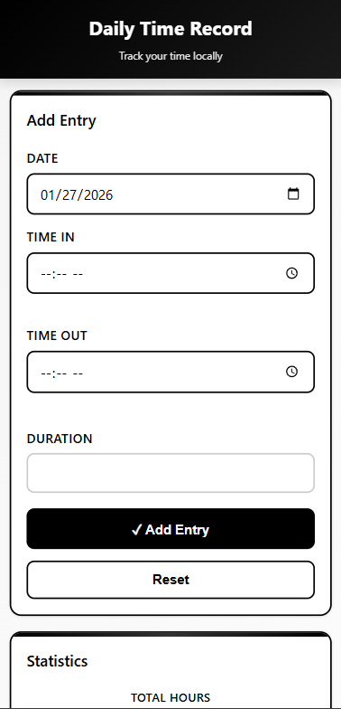
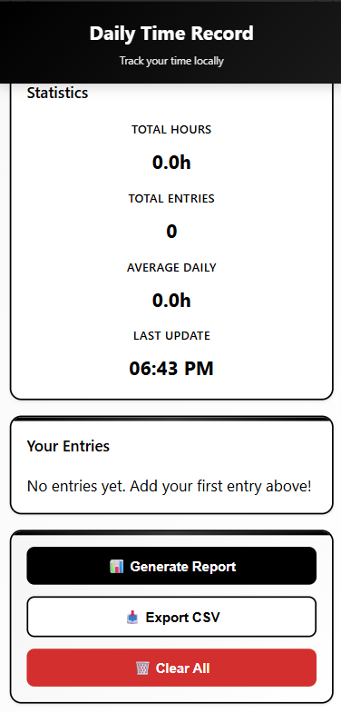

# DTR Mobile (Personal)

A professional HTML+JS mobile-friendly Daily Time Record (DTR) app that stores entries locally in your browser.

## Features

✅ **Time Tracking** - Log work hours with date, time in, time out  
✅ **Auto Duration Calculation** - Automatically calculates hours worked  
✅ **12-Hour Format** - All times display in AM/PM format  
✅ **Statistics Dashboard** - View total entries, total hours, and weekly hours  
✅ **Professional Design** - Modern UI with custom color palette  
✅ **Generate Reports** - Create and view DTR reports  
✅ **Print & Export** - Print to PDF or export as CSV  
✅ **Local Storage** - Data stored privately on your device  

## How to Use

1. Open `index.html` in your browser (desktop or mobile)
2. **Add Entry** - Fill in date, time in, time out, and optional note
3. **View Stats** - See your tracking stats at a glance
4. **Generate Report** - Click "Generate Report" to create a summary
5. **Print/Export** - Print to PDF or export as CSV file
6. **Clear Data** - Delete all entries when needed

## Preview

    
## Color Palette

- **#4A70A9** - Primary Blue
- **#8FABD4** - Light Blue  
- **#EFECE3** - Warm Beige
- **#000000** - Black

## Technology

- Pure HTML5
- Vanilla JavaScript (no frameworks)
- CSS3 with modern layouts
- LocalStorage for data persistence

## Files

- `index.html` - App interface
- `app.js` - Core logic and functionality
- `styles.css` - Professional styling
- `manifest.json` - PWA support

---

**Personal use only** • Data never leaves your device